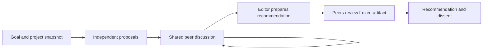

# Collaborative architecture deliberation

Status: proposed design, 2026-09-08. No runtime implemented by this document.

## Goal and recommendation

Given a project and a goal, several agents develop architectural alternatives, exchange their own questions and critiques, revise their reasoning, and produce one usable recommendation with its evidence and remaining disagreements.

Build a **deliberation module**: a small caller interface backed by a shared discussion room. Agents own the ideas and conversation; deterministic code owns delivery, persistence, scheduling, limits, and the conditions under which a result can be reported. Architecture design is its first supported use, rather than a configurable framework for arbitrary agent organizations.

Working assumption: an existing coding agent calls this capability on the user's behalf. A direct CLI and a Kodo tool can call the same module. This invocation preference has been asked but is not yet confirmed. The document lives in Kodo because its local session machinery is the nearest implementation starting point; that does not commit us to a new product or standalone distribution.

Success is a better, implementable design for the available time and cost. An interesting transcript or unanimous panel is insufficient evidence of success.

## Alternatives considered

Three agents independently explored these shapes, then exchanged critiques directly.

| Shape | Strength | Cost or weakness | Decision |
| --- | --- | --- | --- |
| One `deliberate(...)` operation | High leverage: caller delegates the whole design problem | Its internal protocol still needs explicit semantics | Use as the caller interface |
| General shared room with open/post/steer/close operations | Peers can decide whom to question and what to revise | Caller would inherit lifecycle and convergence complexity | Use a small room internally; defer general room interface |
| An architecture workflow embedded in the orchestrator | Easy to launch inside an existing development run | Can become fixed fan-out/review batches or require a lead model to relay everything | Make orchestrator integration a thin caller |

This combines the minimal operation with peer-directed discussion. It does not combine all three feature sets.

## User experience and output

A request can be as simple as: “Work out the architecture for this project's offline synchronization. Use three agents; prioritize simplicity and recovery after disconnection.” The surrounding coding agent supplies the project snapshot, relevant constraints, configured panel, and execution limits.

The user can inspect progress and the transcript. On completion they receive:

- `design.md`: the recommended architecture, responsibilities, interfaces, invariants, errors, principal data/control flows, and a concrete usage example.
- The important alternatives and why the recommendation was chosen, including useful ideas incorporated from other proposals.
- Evidence and assumptions, with source revision references and concrete observations separated from agent assertions.
- Every recorded objection, the editor's response, the critic's current position, and any unresolved trade-off or question.
- A small implementation sequence and acceptance scenarios mapped to the goal's requirements.
- Review coverage, stop reason, resource usage, and a link to the complete discussion record.

The result is a design recommendation. It neither authorizes implementation nor proves that implementation will work. A caller can continue its already-authorized development workflow using the recommendation; the primitive itself does not edit the target project.

## Caller interface

Illustrative Python interface; spelling and sync/async form remain implementation details:

```python
result = deliberate(
    brief=Brief(goal=goal, project=project_snapshot, constraints=constraints),
    panel=configured_panel,
    run_dir=run_dir,
    limits=limits,
)
```

The interface includes these obligations:

- The brief, project snapshot, panel identities, and protocol version are recorded before execution. Two participants are the minimum; three is the first default to evaluate. Independent sessions are required; different providers are optional.
- A panel includes one designated editor, selected before the run. The editor is also a proposer and has no additional authority over peer messages or objections.
- The project input identifies the content actually inspected. A Git commit alone is insufficient when relevant local changes or untracked files are included; capture them explicitly in the snapshot manifest.
- An existing `run_dir` identifies the same run. A different brief, snapshot, panel, or protocol fails clearly rather than silently mixing work. A changed goal starts a new run referencing the old artifact.
- Each stopped invocation returns an immutable status snapshot. Finalized and cancelled runs are terminal: calling them again returns their existing result. Limited or failed runs may resume explicitly after extending the allowance or repairing the failure; usage is cumulative, never reset. Resume continues the recorded phase and frozen review target, if any. Changing an already-frozen candidate requires a new run in the first version.
- Errors retain the run record and name the failed participant or operation. Invalid configuration fails before dispatch. Malformed output is a visible protocol failure; it cannot become an empty successful contribution.
- Interrupting the driver cancels outstanding participant work and records a cancelled result with partial artifacts. Detailed cancellation and process cleanup belong to the execution adapter.

Avoid additional caller concepts such as workflow graphs, topic schedulers, voting algorithms, or provider-specific session handles. The module earns its depth by owning these coordination concerns.

## What native exchange means

A participant can initiate a message to another participant, identify a prior message or proposal, receive the reply verbatim, challenge it, and revise a proposal. The caller never has to relay or rewrite those messages.

The first transport can be structured turn output plus inbox delivery on the next participant invocation. This is asynchronous peer exchange at turn boundaries, not a promise of interrupting an in-flight model. Native tool calls can later expose the same room operations where they materially help. An MCP server is not a prerequisite for agent-directed conversation.

The room needs three kinds of contribution:

| Contribution | Required information | Meaning |
| --- | --- | --- |
| Message | Body, recipient or room, optional reply target and proposal reference | Question, answer, critique, evidence, or rebuttal authored by a peer |
| Proposal | Complete design text, parent revision if revising | An immutable candidate artifact; a revision creates a new ID |
| Review | Frozen review target, position, reasons and objection references | An explicit position on exactly the artifact being finalized |

Critiques and responses carry stable objection IDs when they challenge a decision. This allows final reporting without asking a summarizer to reconstruct whether an objection disappeared. New objections and withdrawals are authored by the critic; an editor may respond, accept a trade-off, or reject the criticism, but cannot record that another agent withdrew it.

The runtime stamps sender identity, sequence, and attempt ID; agents cannot claim another identity. Recipients and references are validated. Messages are public to the panel after the independent opening; directing a message determines whom to wake, not who may ever inspect it. There are no private side conversations in the first version.

Delivery preserves authored text. A wake acknowledgement proves that the message is recorded, not that a peer has read or agreed with it. Each turn records the room sequence it observed. Long histories can be retrieved by reference; omitted content is explicit, and summaries cannot replace the underlying record or erase open objections.

A turn also indicates whether its author has finished for now. A new addressed message or proposal needing its review makes that participant eligible again. Quiescence means every participant has yielded and no required or addressed work remains, not merely that no process is running at that instant.

## Discussion protocol



### 1. Independent opening

Each participant inspects the same brief and source snapshot, then proposes an architecture before seeing peer proposals. Each is a full designer, not a permanently assigned “skeptic” or “security person.” Different emphases can encourage alternatives without forcing arbitrary disagreement.

Hold proposals out of peer-visible inputs until all have submitted. Calling these proposals *sealed* requires that peer files and transcripts are also inaccessible through tools; merely leaving them out of the prompt is weaker and must be described honestly. If an opening participant fails or times out, return incomplete coverage rather than silently reducing the panel.

### 2. Peer-directed discussion

Reveal the proposals together. Give every participant a chance to review them, then schedule turns for new addressed messages and unresolved questions. Agents choose their questions, recipients, evidence, and revisions. They can reuse another proposal, develop a hybrid, or retain a different recommendation.

The scheduler permits at most one in-flight turn per participant. It coalesces multiple incoming messages, rotates fairly among eligible peers, and enforces per-turn and run limits. It does not wake a peer just because an unrelated transcript entry appeared. Reserve one peer review of each opening proposal as part of the minimum protocol. Further revisions and rebuttals use the discretionary allowance; pending replies and unreviewed revisions remain explicit when that allowance ends. Do not claim exhaustive discussion when work was cut off.

Critique should explain a concrete consequence: a requirement missed, an inconsistent interface, a counterexample, an unsupported assumption, or unjustified complexity. Further prose is not a substitute for evidence. For example, a dispute over an existing transaction contract should lead to inspecting that contract. If resolving a dispute requires an execution experiment unavailable in this run, preserve it as a proposed experiment rather than claiming it was verified.

Stop discretionary discussion when all peers indicate they have no further changes and there is no queued exchange, or when its allowance expires. Neither condition implies agreement. Participants cannot create an endless conversation by continuing to post: the runtime owns the finite allowance.

### 3. Synthesis and exact final review

Reserve enough capacity for synthesis and final reviews before spending the discretionary discussion allowance. Stop opening discussion turns, complete or explicitly fence outstanding attempts, and capture the accepted discussion record before dispatching synthesis. The editor selects or combines proposals into one coherent design, explains the choice, and gives a disposition for each discussion-stage objection. Pending exchanges are listed as unfinished. Synthesis is a judgment task; deterministic code cannot decide which architecture is best.

Freeze a review package containing the brief/snapshot identity, candidate text, and objection dispositions. All panel members record a position on that exact package; the editor's nomination records its own position, while the other participants supply independent reviews.

Final reviewers may agree, disagree, or explicitly abstain with reasons. New objections become unresolved dissent in the result; they do not automatically trigger another rewrite or invalidate the target they reviewed. This prevents the review loop from extending forever. The first version uses one final review pass. A revised candidate requires a new review package and fresh reviews, never copied approvals.

The runtime publishes the final record only after all review attempts have completed or been fenced and their accepted contributions are accounted for. Late output from a fenced attempt cannot change a completed result. Discussion messages, review positions, and finalization pass through a single writer so delivery and closure cannot race.

The editor can finalize a contested recommendation. One peer can prevent consensus, but cannot prevent bounded completion or have its dissent erased. A missing review is incomplete coverage, not a vote of agreement.

## Result semantics and authority

Keep these independent rather than inventing a single ambiguous `success` flag:

| Field | Values or meaning |
| --- | --- |
| Stop reason | Finalized, limit, cancelled, or failed; details name the exhausted limit or failure |
| Review coverage | Complete, partial, or none for the frozen target |
| Positions | Each member's agree/disagree/abstain position, or missing |
| Open objections | Authored disagreements, responses, and what remains unresolved |
| Recommendation | Artifact reference, possibly absent if execution stopped too early |

Complete review coverage means every named participant supplied a valid final position. It does not mean agreement; an abstention is visibly different from assent. A finalized recommendation with dissent is useful. A polished recommendation with a crashed reviewer is still only partially reviewed.

The runtime verifies references, coverage, authorship, and protocol compliance. Agents assess the merits and choose a recommendation. The human or calling development workflow decides what to adopt. Neither a numeric vote nor an LLM judge can turn an untested claim into verified evidence.

## Implementation seam and existing code

Put the initial implementation in a focused `kodo.deliberation` module, without requiring the coding orchestrator's cycle lifecycle. Kodo's CLI/tool integration is a caller. Do not create a separate distribution or import Hive's application layers until another real caller demonstrates the need.

Observed starting points:

- [`Session`](../kodo/sessions/base.py) supplies query, cloning, session identity, reset, termination, and usage. It does not define a peer inbox or arbitrary tool injection.
- [`handle_agent_call`](../kodo/orchestrators/agent_tools.py) dispatches a worker and reports back to the orchestrator, with report truncation. That report path is not a lossless peer transport.
- [`mcp_server.py`](../kodo/orchestrators/mcp_server.py) and [`tools.py`](../kodo/orchestrators/tools.py) expose workers as orchestrator tools. They provide a future calling surface, not an existing shared room for workers.
- Hive's [`critique.py`](../../hive/hive/_workstreams/critique.py) runs parallel critics followed by an adjudicator. It has no peer rebuttal or proposal revision loop and should retain its separate spec-critique purpose.

Use one private participant seam: run a bounded turn against explicit context and return structured contributions plus usage. Its first two adapters are one production coding-agent runtime and a scripted participant for integration tests. Reuse actual session behavior where appropriate, but do not broaden every existing backend's interface in advance.

Execution capabilities need validation. Current Kodo [`CodexSession`](../kodo/sessions/codex.py) defaults to `workspace-write`; [`ClaudeSession`](../kodo/sessions/claude.py) uses `bypassPermissions`. Wrapping these defaults and adding “design only” to a prompt does not enforce source non-mutation or keep independent proposals private. The first adapter must provide verified read-only source access, isolated participant scratch/context, and writes to room artifacts through the driver. If the selected runtime cannot honor the required capabilities, fail clearly.

A prompt/schema-based transport is the smallest candidate. The first technical experiment should establish that real agents reliably initiate, receive, and answer structured peer messages under those capability constraints. If they require native room tools to do this well, add tool ingress to that adapter while keeping the protocol and caller interface unchanged. Do not claim universal backend support before this experiment.

## Persistence, limits, and failure

Use one local run directory with a SQLite record owned by the driver, plus human-readable exports. Store the brief, immutable proposals, accepted contributions, attempt states, review target, and final result. This gives atomic contribution acceptance and finalization without introducing a distributed queue or configurable persistence interface. Markdown/JSON exports are derived artifacts and can be rebuilt.

Persist an attempt and its input references before dispatch. Accept its contributions once in a transaction. A retry cannot publish a message twice; its idempotency key is the attempt and contribution index. The source record is authoritative, while provider session IDs are a performance optimization. Reconstruct context from the record if a session cannot resume.

An interrupted provider call may have consumed tokens without returning its result. Resuming can require another invocation and charge again. Do not promise exactly-once inference or exact cost accounting. The record distinguishes unknown usage, a failed attempt, and a completed contribution. Persistence failure stops dispatch; it must not be swallowed as successful logging.

Limits include deadline, total turn allowance, per-turn allowance, and concurrency. Reserve closing turns before discussion and avoid starting work that consumes that reserve. A monetary ceiling is only as enforceable as the runtime's metering and per-call controls; report unknown cost as unknown, with deadline and turn limits still enforced. Failure during closing returns the existing candidate and incomplete coverage.

## Verification and evaluation

Implementation should be tested through the same `deliberate` interface used by callers, with the real local record and scripted participants. Load the project's `tdd` skill before writing those tests.

| Acceptance scenario | Observable evidence |
| --- | --- |
| A questions B; B answers; A revises | Original messages and reply references survive, and the final design cites the changed decision |
| Independent opening | No participant input or permitted tool read exposes earlier peer proposals before release |
| A critic retains a valid concern against the editor's choice | Result preserves the concern and disagreement; completion stays bounded |
| Candidate changes after review | Earlier positions cannot satisfy coverage for the changed package |
| Crash after a contribution was committed, then resume | No duplicate publication; no missing accepted message; unknown provider usage remains explicit |
| Discussion uses its allowance or a final reviewer fails | Closing reserve is honored where possible; partial coverage cannot be reported as complete |
| Late output arrives after cancellation or closure | It cannot mutate the result or count as a valid review |
| Source is accidentally targeted for writing | Required execution adapter rejects mutation; artifact recording still works |

Scripted tests establish protocol correctness, not whether agents collaborate well. A real end-to-end smoke must demonstrate an unsolicited addressed critique, a direct answer, an actual revision, and final positions using the first runtime adapter. Inspect the transcript and source snapshot, not just the output schema.

Evaluate architectural quality on the same briefs and project snapshots against (1) one author plus an independent reviewer, and (2) independent proposals plus a synthesizer with no discussion. Match resource allowances and report actual usage and latency; repeat runs and blind artifact order for review. Compare requirement coverage, concrete defects caught, unjustified complexity, and whether an implementer needs to reopen missing design decisions. Count helpful and harmful changes attributable to peer exchange. Do not use the debating panel's own confidence or agreement as the quality metric.

This evaluation matters because debate's benefit is not established for architecture. *Debate or Vote* finds that independent voting explains much of the improvement on its seven NLP benchmarks; *Demystifying Multi-Agent Debate* studies diversity and calibrated confidence interventions on reasoning QA. These results motivate testing alternatives and protecting independent openings; neither directly validates this software-design protocol. [Choi et al.](https://arxiv.org/abs/2508.17536), [Zhu et al.](https://arxiv.org/abs/2601.19921).

## First implementation sequence

1. Prove the participant adapter: bounded execution, read-only source, isolated opening, structured exchange, and termination. Use a disposable fixture project and two real peer sessions. This resolves the largest implementation uncertainty before building the room.
2. Implement the local record, minimal protocol, and full scripted integration flow. Demonstrate revision, dissent, cancellation, and resume through the caller interface.
3. Connect one three-participant architecture run and produce `design.md` plus its review record. Evaluate it against the two simpler baselines.
4. Expose a thin CLI or coding-agent tool over the proven module. Add Hive integration, live tool transport, or standalone packaging only when an actual caller requires it.

The main design question still worth user steering is the intended entry point: a tool used by an existing coding agent, a dedicated session launched by the user, or an orchestrator-managed step. The discussion protocol and artifact contract should remain the same whichever surface is first.
