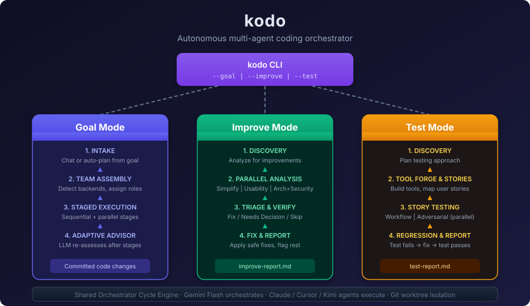
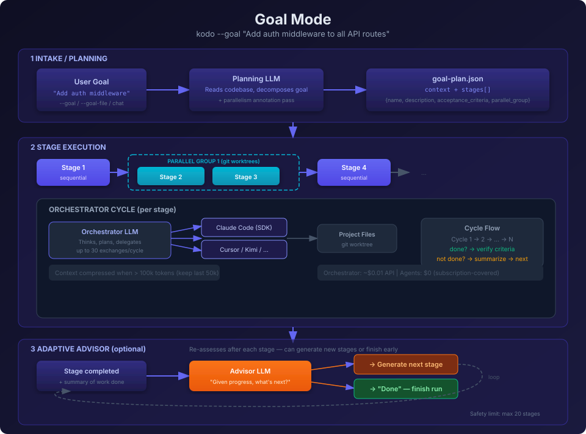
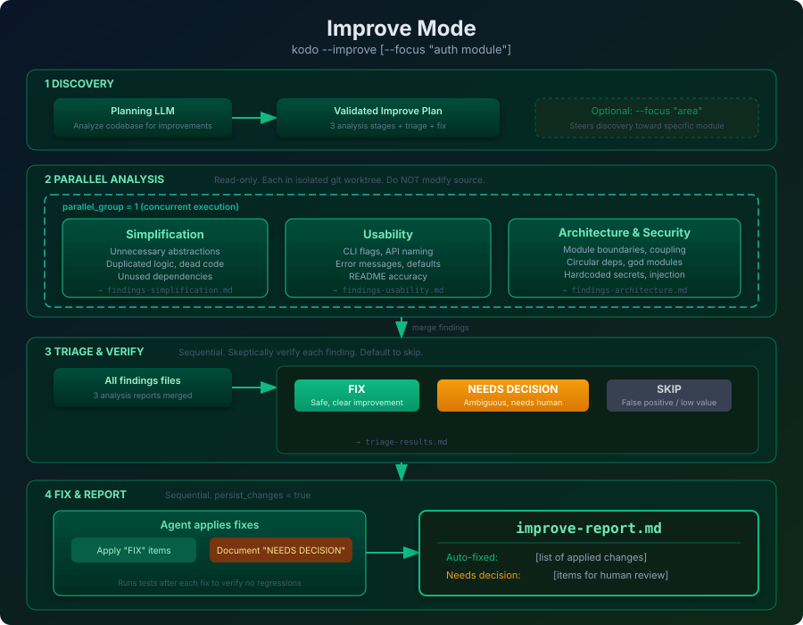
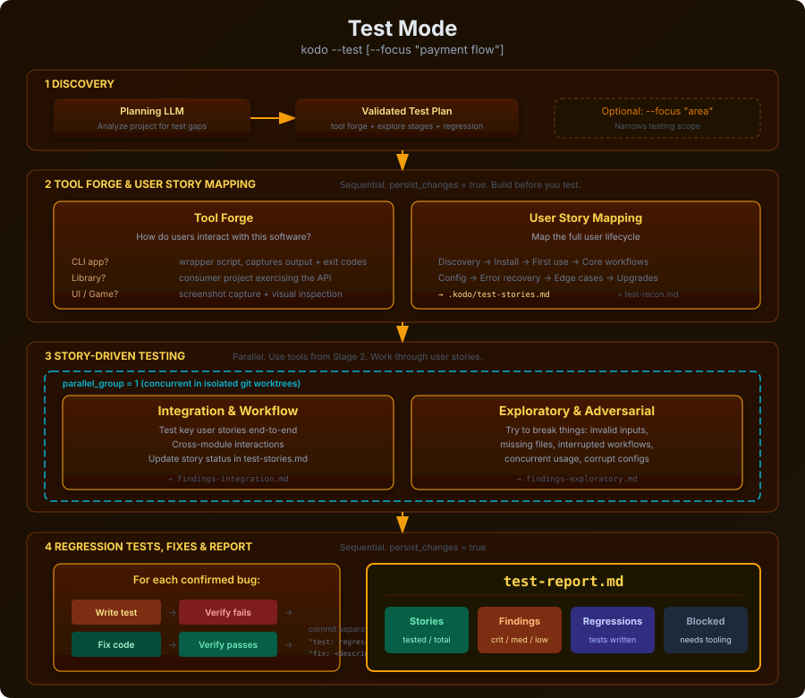

# What Kodo does

## Overview

## Goal Mode (`--goal`)

The primary mode: give kodo a goal, it plans and executes with autonomous agents.

## Improve Mode (`--improve`)

Autonomous code review and refactoring. Parallel read-only analysis feeds into sequential triage + fix.

## Test Mode (`--test`)

Autonomous test generation. Discovers coverage gaps, writes tests in parallel, runs full regression.

